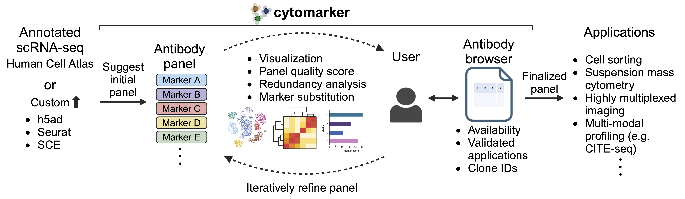

# Cytomarker


:test_tube: Interactive design and validation of antibody panels using single-cell atlases | [www.cytomarker.ai](https://www.cytomarker.ai)

<p align="center">
    
</p>

Cytomarker enables iterative design of antibody panels using single-cell atlases. Key features:

* Pull scRNA-seq from Human Cell Atlas or upload custom data in common formats (`h5ad`, `Seurat`,`SingleCellExperiment`)
* Multiple visualizations and panel quality score to help design
* Identify marker redundancy and suggest substitutions
* Links to antibody databases to filter by application and find clone IDs

## Get started

:desktop_computer: [Launch Cytomarker](https://camlab.shinyapps.io/cytomarker/)

:open_book: [Read documentation](https://camlab-bioml.github.io/cytomarker-doc/docs/intro)

## Supported antibody databases

* The open-source version of Cytomarker hosted here contains antibody information parsed from the [antibody registry](https://www.antibodyregistry.org/)
* The hosted version of Cytomarker contains proprietary antibody databases with additional information (e.g. antibody applications)
* To contribute additional antibody information, please [contact us](mailto:kierancampbell@lunenfeld.ca)


## Installation from source

For those with source code access to cytomarker, installation and access can be achieved through the following commands. Ensure that [R](https://cran.r-project.org/) and [RStudio Desktop from Posit](https://posit.co/download/rstudio-desktop/) are installed for your specific operating system. 

```
git clone https://github.com/camlab-bioml/cytomarker.git
cd cytomarker
```

Once cloned, open RStudio and import the project using `File -> Open Project`, and select the `cytomarker.Rproj` file. After importing the codebase, install the app dependencies:

```
library(devtools) # or, if devtools isn't installed
install.packages(c('devtools', 'remotes'))
```


This will prompt devtools to install all listed dependencies from the package. 

Additional dependencies in R that are suggested by the package may also need to be explicitly installed:

```
additional_deps <- c('stringr',
  'yardstick',
  'htmltools',
  'methods',
  'stats',
  'gridExtra',
  'testthat',
  'tools',
  'scran',
  'Seurat',
  'caret',
  'scuttle',
  'scater',
  'SummarizedExperiment',
  'SingleCellExperiment',
  'clustifyr',
  'zellkonverter',
  'printr',
  'ggplot2',
  'heatmaply',
  'plotly')
  
  BiocManager::install(additional_deps)
```

Once installed, the remaining dependencies should be automatically installed:
```
devtools::load_all();cytomarker()
```

### Running locally

In the command line, execute the following commands:

```
# navigate to the directory with the cytomarker source code
cd cytomarker
R -e 'devtools::load_all(); cytomarker()'
```

The final line will display a message providing the IP address and local port:

```
Listening on http://127.0.0.1:7665
```

Navigate to that IP address in your browser to run.

Alteratively, in the RStudio Desktop console: 

```
devtools::load_all(); cytomarker()
```

## Developers

* Matt Watson
* Eunice Poon
* Michael Geuenich
* Kieran Campbell
